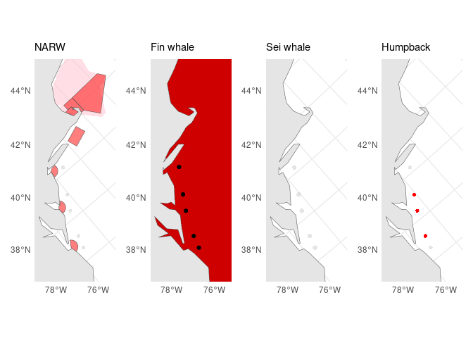

<!-- README.md is generated from README.Rmd. Please edit that file -->

# rtwb-flyway

<!-- badges: start -->

<!-- badges: end -->

This dashboard is currently deployed at
<https://tailwinds.umces.edu/rtwb-flyway>.

## What is this?

Use [R targets](https://docs.ropensci.org/targets/) and GitHub Actions
continuous integration to plot WHOI near-real-time whale buoy (RTWB)
detections for various species in the Mid-Atlantic Flyway.

Basically, an in-house version of <https://whalemap.org/> that also
includes fin, sei, and humpback whales.

Dashboard is updated every day at 05:00 UTC or on demand. The last run
occurred at 2024-03-17 05:04:49.

## Data sources

  - RTWB
      - <http://robots4whales.whoi.edu/>
  - Natural Earth
      - <https://www.naturalearthdata.com/http//www.naturalearthdata.com/download/110m/physical/ne_110m_land.zip>
  - USA NARW critical habitat
      - <https://noaa.maps.arcgis.com/home/item.html?id=3115892b737a447abe2affa7e773701c>
  - CAN NARW critical habitat
      - <https://open.canada.ca/data/en/dataset/db177a8c-5d7d-49eb-8290-31e6a45d786c>
  - NOAA NARW seasonal management areas
      - <https://www.fisheries.noaa.gov/resource/map/north-atlantic-right-whale-seasonal-management-areas-sma>  
  - Slow zones

## Desired output

  - Table with columns:
      - date
      - species
      - detected
      - slow\_zone\_id
      - slow\_zone\_active
  - Figures (5; 4 facets, 1 per species):
      - All:
          - [x] Coastline in OMERC projection
          - [x] Critical habitat polygons
      - Yesterday: 4 plots, 1 per species
          - RTWB location filled if present, point if absent
          - slow zone polygon filled if active, transparent if not
      - 2 days ago
      - One-week running mean
      - Two-week running mean
      - One-month running mean

## Example plot

<!-- -->

## Repository `targets` workflow:

